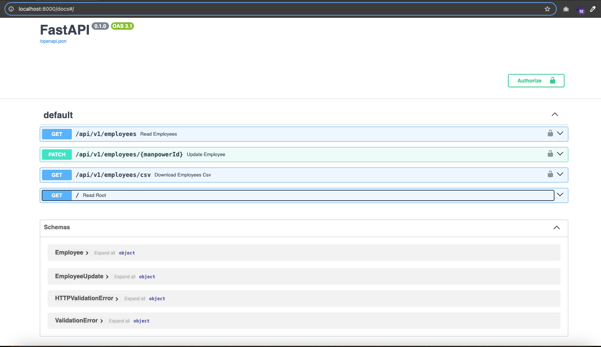
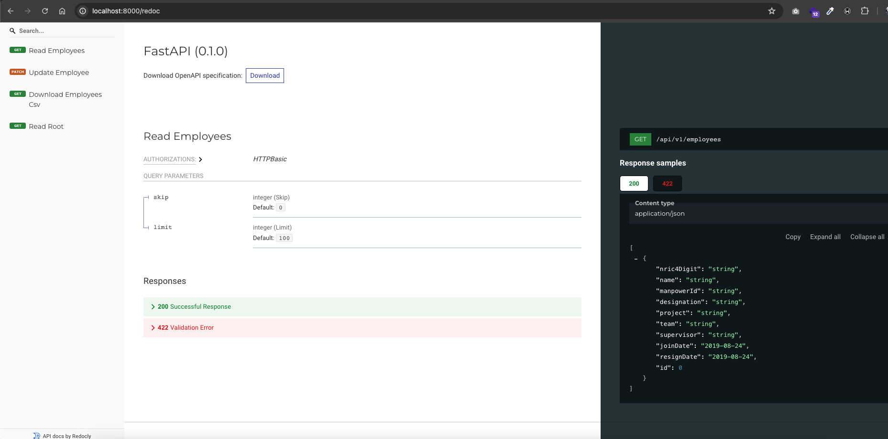

# Employee Management API

This project aims to provide a comprehensive solution for managing employee data using FastAPI, SQLAlchemy, and a Microsoft SQL Server database.
It includes functionalities for viewing, updating, and exporting employee data, as well as implementing basic authentication for securing access to the APIs.

## Features
- **Employee Data Management**: Allows users to view and update employee details such as designation, project, team, supervisor, join date, and resign date.
- **CSV Export**: Provides an endpoint to export employee data in CSV format.
- **Basic Authentication**: Implements basic authentication to secure access to the APIs.
- **API Documentation**: Generates interactive API documentation using Swagger UI and Redocly.

## Table of Contents

- [Project Structure](#project-structure)
- [Installation and Setup](#installation)
- [Configuration](#configuration)
- [Running the Application](#running-the-application)
- [API Documentation](#api-documentation)
- [Usage](#usage)

## Project Structure
```bash
.
├── core
| ├── connection.py
├── middleware
| └── auth.py
├── models
| └── employee.py
├── repository
│ ├── employee.py
├── routes
| └── employee.py
├── schema
| └── employee.py
├── service
│ └── employee.py
├── main.py
```
Structure of the project and the purpose of each directory:

- **core**: Contains core functionalities such as database connection and dependencies.
- **middleware**: Includes custom middleware, such as authentication middleware.
- **model**: Defines database models or ORM classes.
- **repository**: Houses repository classes responsible for database interactions.
- **routes**: Contains route definitions for various endpoints.
- **schema**: Defines Pydantic schemas for request and response validation.
- **service**: Includes service classes implementing business logic.

## Installation and Setup

### Python 3 Installation
Before proceeding, ensure that Python 3 is installed on your machine. If not, follow these steps to install Python 3:

1.  Visit the [official Python website](https://www.python.org/downloads/) and download the latest version of Python 3 for your operating system.

2.  Run the installer and follow the installation instructions.

3.  Verify that Python 3 is installed by opening a terminal or command prompt and running the following command:
```bash
python3 --version
```
### Project Setup
To set up the project environment, follow these steps:

```bash
# Clone the repository
git clone https://github.com/VytouThin/pylon_api

# Navigate to project directory
cd pylon_api

# Install dependencies
pip install -r requirements.txt

or

python3 -m pip install -r requirements.txt
```

## Configuration
Set up the environment variables
- Create a .env file in the project root directory.
- Add the following configurations to the .env file
```bash
DATABASE_USERNAME=sa
DATABASE_PASSWORD=Pa$$w0rd123
DATABASE_HOST=localhost
DATABASE_PORT=1433
DATABASE_NAME=PylonProductionData_ForTesting

# Basic auth credentials
USERNAME=user
PASSWORD=pass

```

## Running the Application
Once the project environment is set up, you can run the FastAPI application:
### Running with uvicorn
```bash
uvicorn app.main:app --reload
```

## Credentials:

Credentials login

```
username: user
password: pass
```

## API Documentation

You can access these API documentations after running the application.

- [Swagger UI (http://localhost:8000/docs)](http://localhost:8000/docs)
- [Redoc UI (http://localhost:8000/redoc)](http://localhost:8000/redoc)

## Usage
### Example with cURL
Here are some example cURL commands to interact with your FastAPI application using Basic Authentication:

1. Encode your credentials (USERNAME
) in base64. You can do this using an online tool or with the following command in a Unix-based terminal:
```bash
echo -n "USERNAME:PASSWORD" | base64
```
Replace USERNAME and PASSWORD with your actual credentials. This will output a base64 encoded string.

2. Use the encoded credentials in your cURL requests.
For example, if the encoded string is dXNlcm5hbWU6cGFzc3dvcmQ=, you can use it as follows:

- Retrieve all employees:
```bash
curl --location 'localhost:8000/api/v1/employees' \ 
--header 'Authorization: Basic dXNlcjpwYXNz'
```
- Update employee details (replace {manpowerId} with the actual ID):
```bash
curl --location --request PATCH 'http://localhost:8000/api/v1/employees/{manpowerId}' \
--header 'Content-Type: application/json' \
--header 'Authorization: Basic dXNlcjpwYXNz' \
--data '{
    "nric4Digit": "0112",
    "name": "Mr A",
    "manpowerId": "EMP1001",
    "designation": "Software Engineer",
    "project": "Project Employee",
    "team": "Software",
    "supervisor": "Emily Garcia",
    "joinDate": "2024-07-20",
    "resignDate": "2024-06-21"
  }'
```
- Download employee data as CSV
```
curl --location 'localhost:8000/api/v1/employees/csv' \
--header 'Authorization: Basic dXNlcjpwYXNz'
```
Replace `dXNlcjpwYXNz` with your actual base64 encoded credentials and http://localhost:8000 with the appropriate URL if your FastAPI application is hosted elsewhere.

## Swagger UI

## Redoc UI



## Conclusion

I will be happy to answer any questions that you may have on this approach, and if you want to lend a hand with the boilerplate then please feel free to submit an issue and/or pull request 🙂

Again to note, this is example can appear as over-architectured for what it is - but it is an example only. If you liked my work, don’t forget to ⭐ star the repo to show your support.
